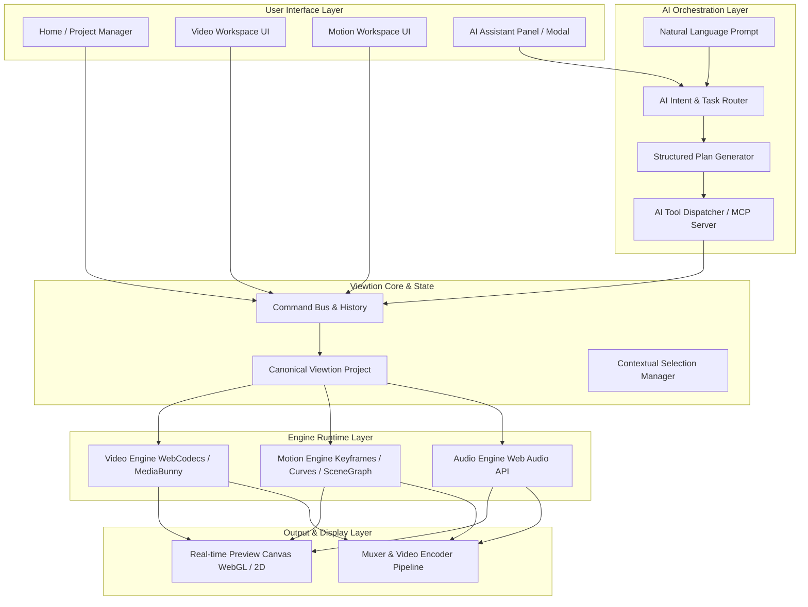

# Viewtion Architecture Specification

## 1. System Overview

Viewtion is an AI-native desktop creative suite unifying **Video Editing** and **Motion Design** into a single cohesive runtime environment.

### Core Data Flow Architecture



### Detailed AI Command Flow

```mermaid
flowchart TD
    subgraph Provider_Layer [AI Providers]
        OpenAI[OpenAI Adapter]
        Anthropic[Anthropic Adapter]
        Gemini[Google Gemini Adapter]
        LocalModel[Local / Custom Model]
        MCPClient[External MCP Client e.g. Antigravity]
    end

    subgraph Router_Pipeline [AI Router & Safety Verification]
        Router[Task Classifier: VIDEO | MOTION | HYBRID | PROJECT | QUESTION]
        Planner[Execution Plan Decomposition]
        PreviewDiff[Edit Preview & Diff Validator]
    end

    subgraph Tool_System [Deterministic Tool API]
        ProjectTools[Project Tools: get_timeline, set_settings]
        VideoTools[Video Tools: add_clip, trim, split, move]
        MotionTools[Motion Tools: create_composition, add_keyframe, set_easing]
        MediaTools[Media Tools: list_assets, get_frames]
    end

    subgraph Execution [Editor Core Execution]
        Commands[Typed Command Objects with undo / redo]
        UndoStack[Grouped Undo History]
        CanonicalProject[Immutable Project State]
    end

    OpenAI --> Router
    Anthropic --> Router
    Gemini --> Router
    LocalModel --> Router
    MCPClient --> Router

    Router --> Planner
    Planner --> PreviewDiff
    PreviewDiff --> Tool_System

    Tool_System --> Commands
    Commands --> UndoStack
    Commands --> CanonicalProject
```

---

## 2. Monorepo Package Breakdown

```
viewtion/
├── apps/
│   └── desktop/               # Tauri 2 Desktop Shell + Vite/React App
├── packages/
│   ├── project-schema/        # Canonical project type definitions & Zod validators
│   ├── editor-core/           # Command bus, undo/redo, universal object model, state
│   ├── video-engine/          # WebCodecs frame sequencer, track management, clipping
│   ├── motion-engine/         # Scene graph, Bezier easing, keyframes, canvas drawing
│   ├── audio-engine/          # Web Audio context, waveform analysis, beat detection
│   ├── render-engine/         # Unified canvas compositor (video + dynamic motion comps)
│   ├── ai-core/               # Provider abstraction, prompt templates, intent router
│   ├── ai-tools/              # Deterministic tool implementations for AI & MCP
│   ├── mcp-server/            # Model Context Protocol server exposing Viewtion tools
│   ├── ui/                    # Design tokens, shared professional dark-theme components
│   └── brand-kit/             # Brand kit models, font registries, and color palettes
├── docs/                      # Technical specifications, ADRs, and guides
└── assets/                    # Static assets, branding, and templates
```

---

## 3. Dynamic Linking: Motion in Video

A key innovation of Viewtion is the zero-overhead dynamic integration between Video and Motion workspaces:
1. When a user creates or edits a **Motion Composition** (e.g. `comp_title_01`), it is stored in the project's `motionCompositions` dictionary with its own independent layer tree, keyframes, and canvas size.
2. In the **Video Workspace**, this is referenced as a `MotionCompositionClip` on any video track:
   ```ts
   interface MotionCompositionClip extends BaseClip {
     type: 'motionComposition';
     compositionId: string;
     start: number;     // Start time in video sequence (seconds)
     duration: number;  // Duration on timeline (seconds)
     speed: number;     // Playback rate multiplier
   }
   ```
3. During playback or export, the **Unified Compositor** calculates:
   $$t_{motion} = (t_{timeline} - clip.start) \times clip.speed$$
   It then renders the motion composition scene graph at $t_{motion}$ directly onto the video composite buffer.
4. Double-clicking the clip switches to the Motion Editor workspace for instant visual refinement. Any change is instantaneously reflected back in the video timeline without re-rendering or intermediate video flattening.

---

## 4. Design System Tokens

The application features a professional, high-contrast dark theme inspired by the approved design mockup:
- **Backgrounds:** Canvas `#0D0D10`, Panels `#141418`, Cards `#1C1C22`, Hover `#25252E`
- **Borders:** Subtle `#2A2A34`
- **Accents:** Vibrant Lime/Chartreuse `#E2F952` (Buttons, Active Pills, Playhead, Guides)
- **Secondary Accents:** Purple `#9D7BFF` (Titles/Motion clips), Cyan `#38BDF8` (Audio waveforms, keyframe handles)
- **Typography:** Professional clean sans-serif with tabular numerals for timecodes.
